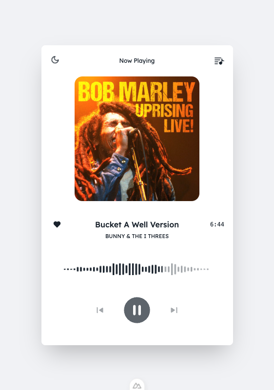

# Nuxt 4 Audio Player with Favorites

A modern Nuxt 4 application with Vue 3, Vite, and TailwindCSS.
This is for only one station, Scratch Radio. It uses Spotify album art using the Spotify API, and Unsplash as fallback.



---

## Features

- **Nuxt 4 + Vue 3** with Vite for fast dev experience
- **TailwindCSS** for utility-first styling
- **Color Mode Support** (light/dark)
- **Client-side streaming** from Icecast (`http://scratch-radio.ca:8000/stream`)
- **Live track updates** using Icecast JSON API
- **Spotify album art lookup**
- **Unsplash fallback**
- **TypeScript** support for type safety
- **Prettier & ESLint** for code style and linting

---

## Installation

Clone the repo and install dependencies:

```bash
bun install
```

---

## API Keys

This app requires **Spotify** and **Unsplash** API keys to fetch album art and fallback images.

### 1. Spotify API Key
- Go to [Spotify Developer Dashboard](https://developer.spotify.com/dashboard)
- Create a new app and copy your **Client ID** and **Client Secret**
- You’ll use these to authenticate and request album art data

### 2. Unsplash API Key
- Go to [Unsplash Developers](https://unsplash.com/developers)
- Register a new app and copy the **Access Key**
- This will be used to fetch fallback background images when no album art is found

---

## Environment Variables

Create a `.env` file in the root of your project and add:

```env
# Spotify API
SPOTIFY_CLIENT_ID=your_spotify_client_id
SPOTIFY_CLIENT_SECRET=your_spotify_client_secret

# Unsplash API
UNSPLASH_ACCESS_KEY=your_unsplash_access_key
```

After creating or updating `.env`, restart the development server.

---

## Running the App

Start the development server:

```bash
bun dev
```

Build for production:

```bash
bun run build
```

Preview production build:

```bash
bun run preview
```

---

## 🎧 Usage

- The app will stream music directly from Icecast
- Track info updates live from the Icecast JSON API
- Album art is fetched from Spotify automatically
- If no Spotify art is found, a random Unsplash image is used as a fallback
- You can like tracks to build your **favorites playlist** (stored in local storage)

---

## 🛠 Tech Stack

- [Nuxt 4](https://nuxt.com/)
- [Vue 3](https://vuejs.org/)
- [Vite](https://vitejs.dev/)
- [TailwindCSS](https://tailwindcss.com/)
- [Spotify Web API](https://developer.spotify.com/documentation/web-api/)
- [Unsplash API](https://unsplash.com/developers)
- [TypeScript](https://www.typescriptlang.org/)
- [Prettier](https://prettier.io/) + [ESLint](https://eslint.org/)

---

## 📄 License

MIT License. See [LICENSE](./LICENSE) for details.
