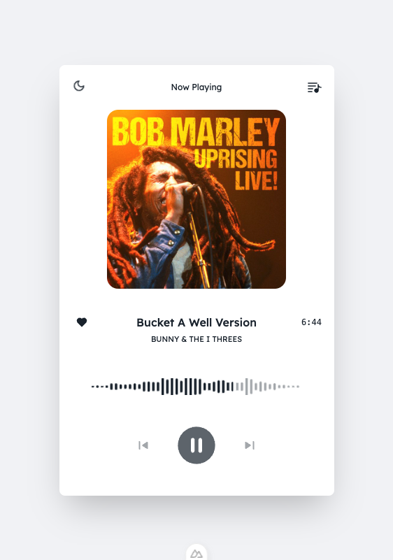

# Nuxt 4 Scratch Radio Player

A single-station web audio player for Scratch Radio built with Nuxt 4, Vue 3, and TailwindCSS.



---

## Features

- **Live radio stream playback** from Icecast (`http://scratch-radio.ca:8000/stream`)
- **Track metadata polling** from Icecast status API
- **Album art lookup via iTunes Search API** (no Spotify dependency)
- **Unsplash fallback art** when iTunes artwork is unavailable
- **Favorites playlist** stored in localStorage (like, remove, download JSON)
- **Mobile-first unified player layout** optimized for phone viewport
- **Light/Dark mode** with color mode toggle
- **Componentized UI structure** (`NowPlaying`, `AlbumArt`, `AlbumTitle`, `AudioWaveform`, `AudioControls`)

---

## Installation

```bash
bun install
```

---

## Environment Variables

Only Unsplash is optional now. iTunes lookup does not require API credentials.

Create a `.env` file in the project root if you want fallback images:

```env
NUXT_UNSPLASH_ACCESS_KEY=your_unsplash_access_key
```

If `NUXT_UNSPLASH_ACCESS_KEY` is not set, the player still works and will simply return no fallback image when iTunes has no artwork.

---

## Running the App

```bash
bun dev
```

Build for production:

```bash
bun run build
```

Preview production output:

```bash
bun run preview
```

---

## Usage Notes

- Press **Space** to toggle play/pause.
- Track title, artist, and elapsed time update while streaming.
- Click the heart to save the current track to favorites.
- Open favorites from the top-right button to manage or export your list.

---

## Tech Stack

- [Nuxt 4](https://nuxt.com/)
- [Vue 3](https://vuejs.org/)
- [TailwindCSS](https://tailwindcss.com/)
- [Vite](https://vitejs.dev/)
- [iTunes Search API](https://developer.apple.com/library/archive/documentation/AudioVideo/Conceptual/iTuneSearchAPI/index.html)
- [Unsplash API](https://unsplash.com/developers)
- [TypeScript](https://www.typescriptlang.org/)
- [ESLint](https://eslint.org/) + [Prettier](https://prettier.io/)

---

## License

MIT License. See [LICENSE](./LICENSE) for details.
